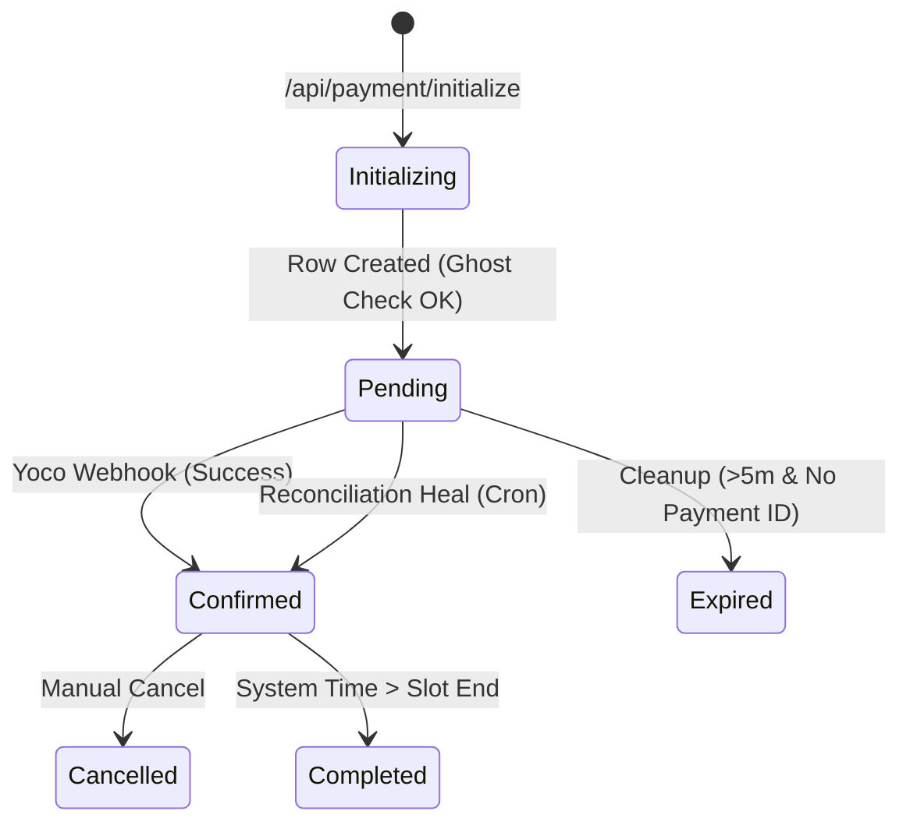

# 🏌️ THE MULLIGAN: Universal Technical Manifest (Venue OS)

This document is the **Industrial Source of Truth** for *The Mulligan*. It serves as the primary RAG context for IDE alignment, system rebuilding, and debugging.

---

## 🏛️ 1. Infrastructure & Architecture
- **Runtime**: Next.js 15 (App Router) on **Cloudflare Pages**.
- **Edge Adapter**: `@opennextjs/cloudflare` (v1.17+).
- **The Underscore Rule**: Cloudflare Pages requires the entry point at `.open-next/_worker.js`. 
- **Asset Hoisting**: OpenNext nests assets in `.open-next/assets/`. The build pipeline MUST hoist these to the root of `.open-next/` to avoid 404s.

### 🏗️ Deployment Logic ([deploy.sh](file:///c:/Users/samue/OneDrive/Documents/projects/TheMulligan/scripts/deploy.sh))
```bash
#!/bin/bash
# 1. Build using OpenNext
npx @opennextjs/cloudflare build

# 2. Standardize Entry Point
if [ -f ".open-next/worker.js" ]; then
    mv .open-next/worker.js .open-next/_worker.js
fi

# 3. Hoist Assets
if [ -d ".open-next/assets" ]; then
    cp -r .open-next/assets/* .open-next/
    rm -rf .open-next/assets
fi
```

---

## 💾 2. The Data Contract (Supabase/PostgreSQL)

### Table: `public.bookings`
| Column | Type | Constraints | Purpose |
| :--- | :--- | :--- | :--- |
| [id](file:///c:/Users/samue/OneDrive/Documents/projects/TheMulligan/lib/utils.ts#50-60) | `uuid` | `PRIMARY KEY` | Unique internal reference |
| `booking_request_id` | `text` | `UNIQUE` | Idempotency Anchor (Frontend Generated) |
| `slot_start` | `timestamptz` | - | Precise SAST Start (+02:00) |
| `slot_end` | `timestamptz` | - | Precise SAST End (+02:00) |
| `simulator_id` | `integer` | `FK -> simulators.id` | Lounge(1), Middle(2), Window(3) |
| `status` | `text` | `DEFAULT 'pending'` | pending, confirmed, cancelled, expired |
| `yoco_payment_id` | `text` | `UNIQUE` | Link to Yoco Checkout session |
| `amount_paid` | `numeric` | `DEFAULT 0` | Actual ZAR received |
| `email_sent` | `boolean` | `DEFAULT false` | Atomic Guard for n8n triggers |

### 🔒 Invariant: The "Golden Guard"
Double-bookings are physically impossible via the PostgreSQL Exclusion Constraint:
```sql
ALTER TABLE public.bookings
ADD CONSTRAINT exclude_overlapping_slots
EXCLUDE USING gist (
  simulator_id WITH =,
  tstzrange(slot_start, slot_end, '[)') WITH &&
);

-- Atomic Ghost Cleanup: Run before new booking attempts
CREATE OR REPLACE FUNCTION purge_ghost_bookings()
RETURNS void AS $$
BEGIN
  DELETE FROM public.bookings
  WHERE status = 'pending'
    AND yoco_payment_id IS NULL
    AND created_at < (now() - interval '5 minutes');
END;
$$ LANGUAGE plpgsql SECURITY DEFINER;
```

---

## 🔄 3. State Machine & Lifecycle

### Logic Flow Diagram


### The "Ghost Cleanup" Protocol
Executed at the start of every `/api/payment/initialize` call:
1.  **Scan**: Identity `pending` rows where `created_at < (now - 5min)`.
2.  **Filter**: Only rows with `yoco_payment_id IS NULL` or abandoned status.
3.  **Delete**: Hard-delete from database using `supabaseAdmin` to free up the `EXCLUDE` slots for the new requester.

---

## 🔴 4. The Failure Matrix (Self-Healing)

| Error Code | Context | Failure Mode | Self-Healing Step |
| :--- | :--- | :--- | :--- |
| **`23P01`** | Database | Slot Conflict (Race Condition) | 1. Force-delete ghost rows for that bay. 2. Retry `INSERT` once. |
| **`404 (Assets)`** | Frontend | Assets nested in `/assets` | Run [deploy.sh](file:///c:/Users/samue/OneDrive/Documents/projects/TheMulligan/scripts/deploy.sh) to hoist files to root structure. |
| **`401 (Auth)`** | API | Webhook/Reconcile Secret Mismatch | Check `RECONCILE_SECRET` and `N8N_WEBHOOK_SECRET` in `.env`. |
| **`YOCO_500`** | Checkout | Yoco API Disturbance | Log correlation ID; trigger manual reconcile fallback. |
| **`UTC_DRIFT`** | Logic | Time relative to UTC, not SAST | Force `+02:00` offset in [createSASTTimestamp](file:///c:/Users/samue/OneDrive/Documents/projects/TheMulligan/app/api/bookings/check-availability/route.ts#7-12) helper. |

> **Logic Implementation for 23P01**: When the database returns a 23P01 conflict, the API must:
> 1. Call `purge_ghost_bookings()` via RPC.
> 2. Wait 200ms.
> 3. Attempt the `INSERT` one final time before returning a 409 Conflict to the user.

---

## 🔑 5. Environment Variable Manifest
| Variable | Required | Purpose |
| :--- | :--- | :--- |
| `NEXT_PUBLIC_SITE_URL` | Yes | Success/Cancel Redirect base URL |
| `NEXT_PUBLIC_SUPABASE_URL` | Yes | Client Interaction |
| `NEXT_PUBLIC_SUPABASE_ANON_KEY` | Yes | Frontend Reads/Client Inserts |
| `SUPABASE_SERVICE_ROLE_KEY` | Yes | Ghost Cleanup (Admin Overrides) |
| `YOCO_SECRET_KEY` | Yes | Payment Processing / API Verification |
| `RECONCILE_SECRET` | Yes | Cron Auth for Reconciliation Worker |
| `ADMIN_PIN` | Yes | Manual Dashboard Action (Default: 8821) |
| `N8N_WEBHOOK_URL` | Yes | Booking Confirmation Trigger |
| `N8N_WEBHOOK_SECRET` | Yes | Security Secret for n8n payload |

---

## 🧠 6. Operational Guardrails
1.  **RPC Truth**: Always call `get_price` SQL function for pricing. Do not trust UI math.
2.  **SAST Authority**: Never use `new Date()` without an explicit timezone string.
3.  **Deterministic Automation**: n8n triggers must be idempotent; check `email_sent` BEFORE dispatching.

### **SAST Authority Helper**
```typescript
/**
 * Normalizes any date/time input to a strict SAST (UTC+02:00) ISO string.
 * Prevents Cloudflare Edge UTC-zero drift.
 */
export function createSASTTimestamp(date: string, time: string): string {
  const cleanTime = time.length === 5 ? `${time}:00` : time;
  return `${date}T${cleanTime}+02:00`;
}
```

---
**Definition of Done**: A feature is "operational" only if it survives a build simulation with asset hoisting and passes an idempotency test using a duplicate `booking_request_id`.
